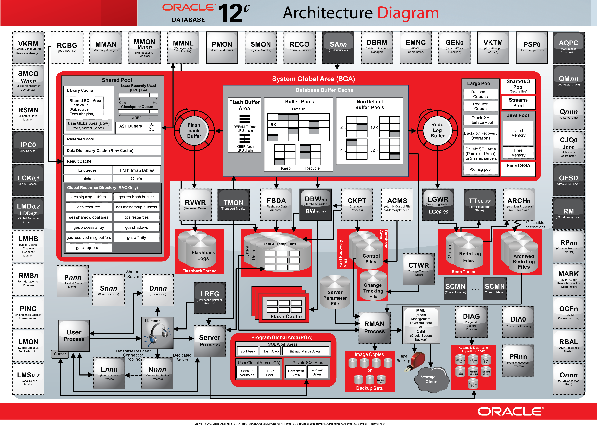

# Oracle DBMS 아키텍처

## 아키텍처 이해의 필요성
DBMS는 데이터베이스를 관리하고 운영한다.  
DBMS의 아키텍처의 구조, 구성요소, 동작 방식에 대한 이해가 바탕이 되어야만 데이터베이스의 성능 품질을 진단하고 이상현상을 통제할 수 있다.  
## 아키텍처를 이해했을 때 얻을 수 있는 장점
* Oracle DBMS 외 다른 DBMS의 경우도 아키텍처가 유사하기 때문에 쉽게 이해하는것이 가능해진다.
* 아키텍처의 기본적인 구조는 자주 변경되지 않는다. 따라서 새로운 버전의 DBMS가 나오는 경우 쉽게 학습이 가능하다.
* 성능 문제가 발생하는 경우 아키텍처 구조적으로 접근해 문제를 판단하고 해결할 수 있다.
DBA가 알아야 할 복잡한 아키텍처 대신 개발자 관점에서 알아야 할 내용만 담은 추상화 된 DBMS아키텍처를 가지고 공부해보려고 한다.

## 1. Oracle DBMS의 구조
Oracle DBMS는 크게 Instance와 Database로 구성된다.  
Instance와 Database는 다시 아래와 같이 분류된다.
* Instance
  * SGA
   * Shared Pool
   * Data Buffer Cache
   * Redo Log Buffer Cache
  * Background Processes
   * User Process
   * Server Process
* Database
  * Data files
  * Control files
  * Redo log files

### Instance  
인스턴스는 사례, 요소, 실재 라는 사전적 의미를 가진다.  
자바에서 클래스를 인스턴스화 시킬 때 비로소 실제 메모리에 할당되어 사용 가능한상태가 되어 작동하는 것을 생각하면 된다.  
Oracle DBMS에서도 마찬가지로 디스크에 저장된 데이터들이 사용이 가능해 지려면 메모리를 할당받아야 하는데, 메모리(SGA)와 프로세스를(Background Process)를 인스턴스라고 한다.  

### Database
2가지 의미를 나타낸다.  
1. 흔히 알고 있는 데이터 저장소를 아우르는 개념  
2. 디스크에 저장되는 실제 파일들
# 1. 유저프로세스와 서버 프로세스

## 유저프로세스
SQL을 보내는 모든 것들이다. SQL Developer, Toad, Sql 구현한 자바 앱 등등... SQL을 Send 하는것들을 칭한다.

## 서버프로세스
유저프로세스가 보낸 SQL을 처리하는 프로세스이다.
서버프로세스는 SQL을 Parsing, Excute, Fetch 하는 과정을 수행한다.

## 인스턴스

## SGA(System Global Area)
DBMS의 메모리 영역이다.

